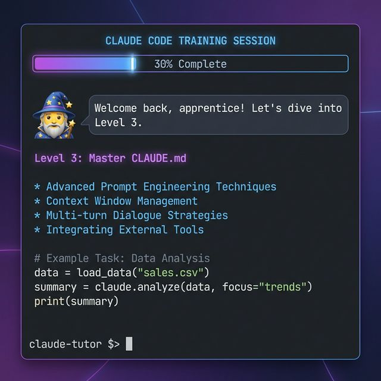

# 🧠⚡ Claude Code Mastery

Level up your development workflow with Claude Code in 15 minutes. Real examples in Python, JavaScript, and more.



## 🚀 Instant Install (Antigravity Only)
Copy and paste the text below directly into your Antigravity chat:

> Hey Antigravity, please clone `https://github.com/bbergmann/claude-code-workflow-tips.git` into this Workspace. Once it's ready, run the `/learn-claude-code` workflow to start my training session!

---

## 💎 Setup as a Gemini Gem
Want to use Claude Code Mastery directly in Google Gemini? [Follow these instructions](./GEMINI_GEM_INSTRUCTIONS.md) to create your own custom Gem:

1. Open [Gemini](https://gemini.google.com/) and click **"Gems"** -> **"New Gem"**.
2. Name it **"Claude Code Coach 🧠"**.
3. Copy and paste the instructions from [GEMINI_GEM_INSTRUCTIONS.md](./GEMINI_GEM_INSTRUCTIONS.md) into the instructions box.
4. Hit **Create**! 🚀

---

## 💻 Manual Setup
1. **Clone this repo:**
   ```bash
   git clone https://github.com/bbergmann/claude-code-workflow-tips.git
   ```

2. **Open in Antigravity:**
   Open this folder in your Antigravity IDE.

3. **Start the Training:**
   Type `/learn-claude-code` in the chat to begin your session.

## 🌟 What's Inside?
- **9 Progressive Levels:** From planning to parallel execution mastery.
- **Real Code Examples:** Python, JavaScript/TypeScript, and CLI tools.
- **Developer Workflows:** Git worktrees, tmux sessions, custom CLI skills.
- **The Boss Battle:** Build a GitHub Analytics CLI using all techniques.
- **Quick Tips Mode:** Get instant workflow advice for your specific challenge.

## 📚 Curriculum Overview
| Level | Topic |
|-------|-------|
| 0 | Welcome & Introduction |
| 1 | Start with Plan Mode |
| 2 | Break Down Tasks |
| 3 | Master CLAUDE.md |
| 4 | Context Management |
| 5 | Custom Skills |
| 6 | Parallel Power |
| 7 | Project Integration |
| 8 | 👹 Boss Battle |
| 9 | 🎓 Graduation |

## 💡 Key Workflow Tips

### General Workflow
- **Start with Plan Mode:** "I sit, I ask CC what to do (in plan mode), I review and refine the plan and I ask CC to implement."
- **Break Down Tasks:** "I feed it small tasks at a time, not full features." Feed Claude Code small, manageable tasks rather than large features to ensure higher quality output.
- **Use CLAUDE.md:** "Claude reads it automatically on every session. Put your conventions, gotchas, and architecture decisions there." This file is crucial for maintaining context and consistency across sessions.

### Context Management
- **Wrap Up and Catch Up:** "So instead of /compact: /wrapup saves what matters, /clear, then /catchup picks it up." Use these commands to manage context effectively.
- **Keep Context Utilization Low:** "One non-obvious trick: keep context utilization below ~50%." Aim to keep the context window below 50% to avoid performance issues.

### Advanced Techniques
- **Custom Skills:** "Custom skills in ~/.claude/commands have been the biggest unlock for me." Create custom skills to automate repetitive tasks and improve efficiency.
- **Parallel Sessions:** "I run 5 Claudes in parallel in my terminal." Run multiple Claude Code instances using tools like tmux or Git worktrees.

### Project Management
- **Use Specific Tools:** "I'm using https://github.com/cowwoc/claude-code-cat/ at the moment for solo dev work." Integrate Claude Code with project management tools for a comprehensive workflow.
- **Markdown-Based Documentation:** "I'd recommend going all in on markdown." Use Markdown for detailed documentation and architectural decisions.

## 🌐 Communities
- [r/ClaudeAI](https://reddit.com/r/ClaudeAI)
- [r/ClaudeCode](https://reddit.com/r/ClaudeCode)

## 🛠️ Requirements
- Antigravity IDE
